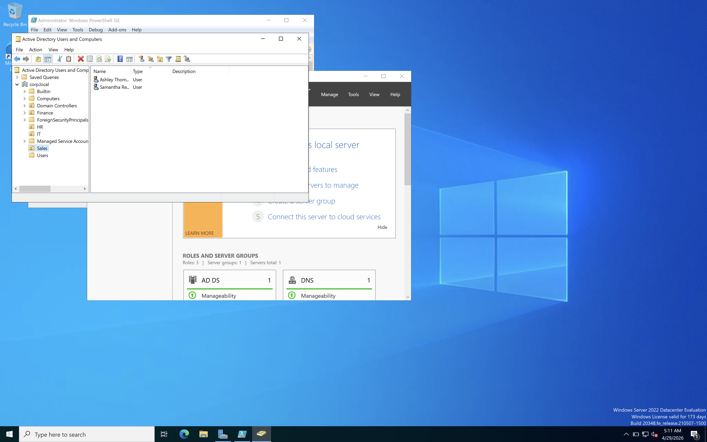
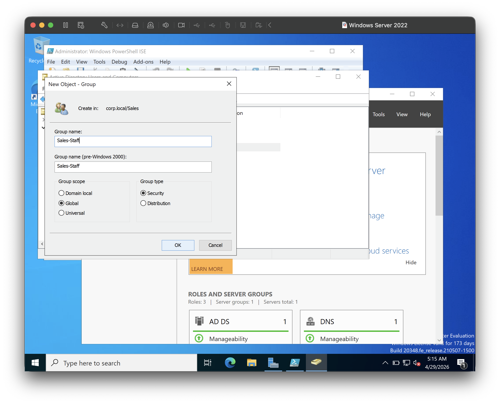
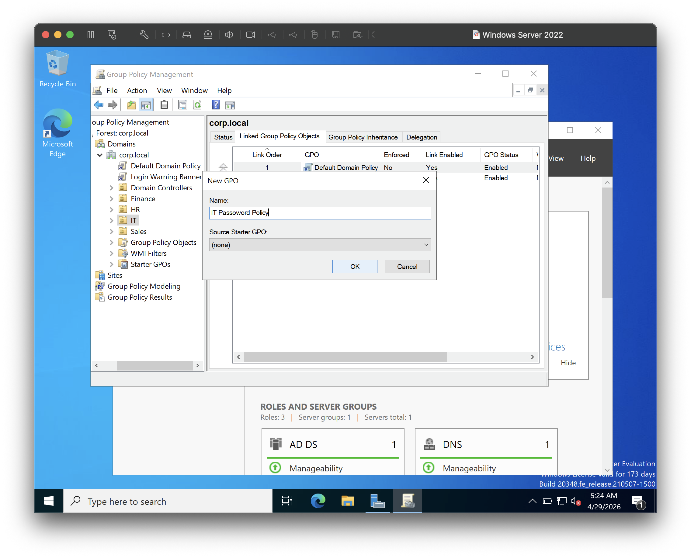
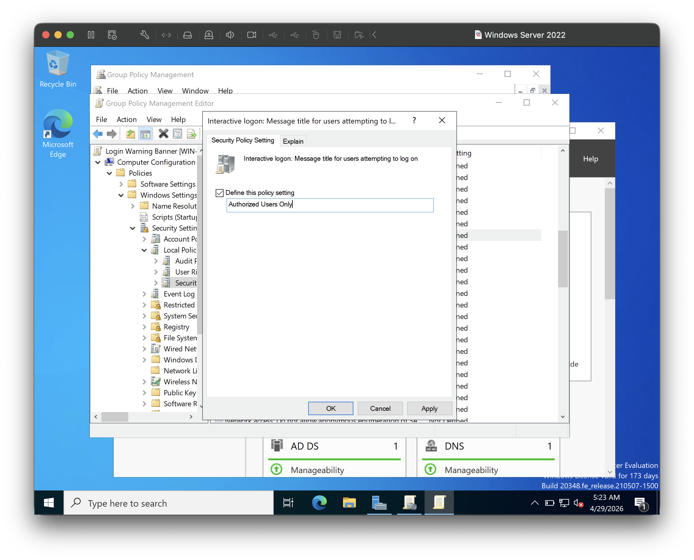
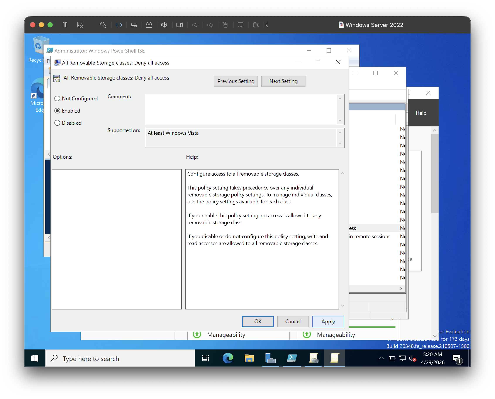
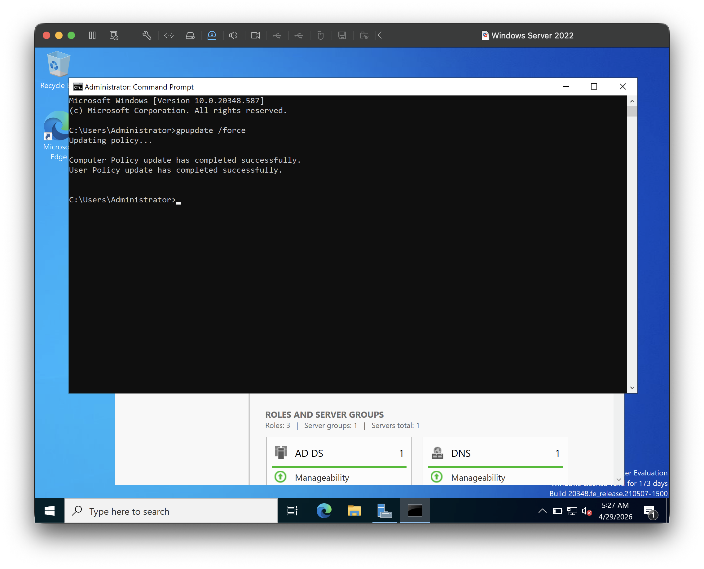

# Home Lab — Active Directory with Windows Server 2022

## Overview
A virtualized home lab built on macOS using VMware Fusion 13.
Simulates a small enterprise environment with a Windows Server 2022
Domain Controller running Active Directory Domain Services.

## Tools Used
- VMware Fusion 13 (macOS)
- Windows Server 2022 Evaluation
- Active Directory Domain Services (AD DS)
- Group Policy Management Console (GPMC)
- PowerShell

## What I Built

### Active Directory Structure
- Deployed Windows Server 2022 as a Domain Controller for `corp.local`
- Created 4 Organizational Units: IT, HR, Finance, Sales
- Created and managed 10 user accounts distributed across departments
- Created Security Groups (IT-Staff, HR-Staff, Finance-Staff, Sales-Staff)
- Assigned users to their respective security groups

### Group Policy Objects
| GPO | Scope | Purpose |
|-----|-------|---------|
| Login Warning Banner | Domain-wide | Displays legal warning at login |
| Disable USB Storage | Finance OU | Prevents removable storage access |
| IT Password Policy | IT OU | Enforces 12-char minimum, 90-day expiry |

### Automation
Wrote a PowerShell script to bulk-create AD users across OUs automatically.
See `scripts/create-users.ps1`

## Network Diagram

## Screenshots

### Active Directory Users and Computers

### Group Policy Management

### Server Manager

## What I Learned
- How Active Directory structures users and resources in an enterprise network
- How Domain Controllers authenticate and authorize users on a domain
- How Group Policy enforces security baselines across departments
- How to automate user provisioning with PowerShell
- Practical Windows Server 2022 administration skills
